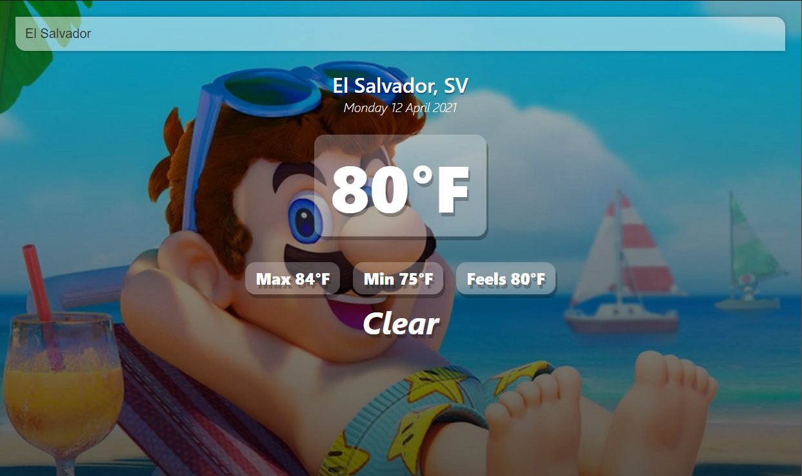

&nbsp; &nbsp; &nbsp; &nbsp; &nbsp; 

## TranslateMe Frontend
&nbsp;

## Table of contents
* [General info](#general-info)
* [Technologies](#technologies)
* [images](#images)

## General info

Implemented a beautiful user interface employing Vue.js.
Developed in firebase.
Fetching Weather from OpenWeatherMap and location from geolocation-DB. Simple and fast way to get your weather's location.
	
## Technologies

Project is created with:
* Vue version: 
* HTML
* CSS

## Images

##### Login 
 

##### User 
 

